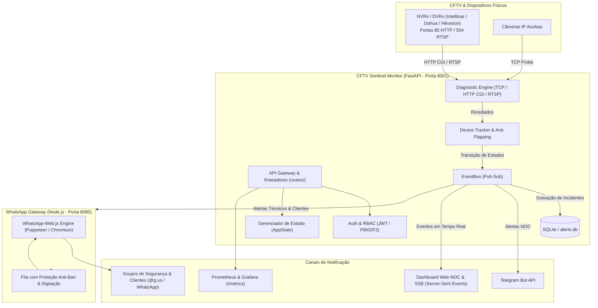
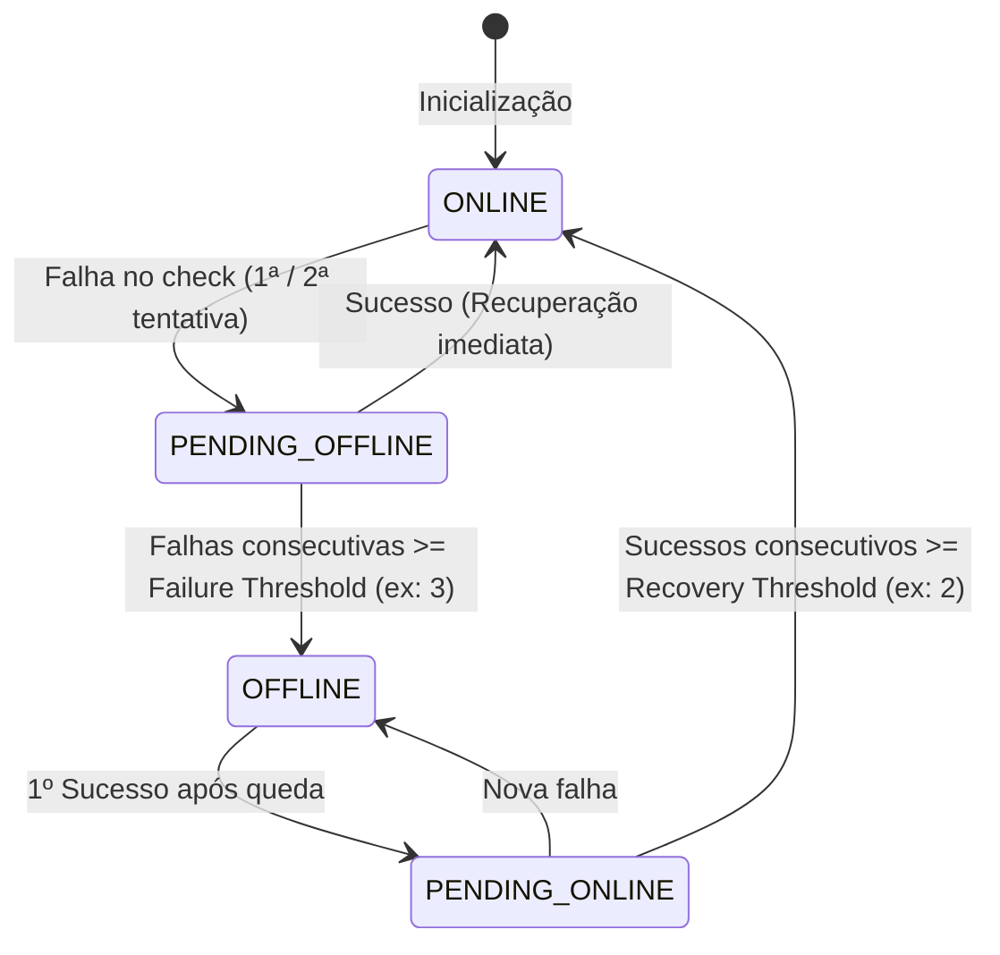

# 🏛️ Arquitetura do Sistema — CFTV Sentinel

Este documento descreve a arquitetura técnica, divisão em camadas, fluxo de dados e máquina de estados do **CFTV Sentinel v2.0**.

---

## 🗺️ Visão Geral da Arquitetura

O sistema é construído como um conjunto de microserviços desacoplados e orientados a eventos:

---

## 🧩 Camadas e Módulos do Sistema

### 1. `core/` (Regras de Negócio e Motores)
* **`checker.py`**: Motor de diagnóstico de conectividade híbrida (Sockets TCP assíncronos e captura rápida de frames HTTP CGI / RTSP).
* **`tracker.py`**: Máquina de estados finitos (*FSM*) por câmera e lógica de agrupamento de gravadores (*NVR Group Health*).
* **`event_bus.py`**: Barramento assíncrono interno (*Pub-Sub*) para desacoplar detecção, alertas e persistência.
* **`notifier.py`**: Serviço de formatação de mensagens técnicas para NOC e amigáveis para clientes, com controle anti-flood (cooldown de 10 min).
* **`security.py`**: Criptografia de senhas em repouso com AES-256 e sanitização de dados.
* **`auth.py`**: Autenticação com JWT, PBKDF2-SHA256, controle de permissões por roles (`admin`, `operator`, `viewer`) e rate limiting anti-força bruta.
* **`database.py`**: Camada de persistência em SQLite para histórico de incidentes e auditoria.

### 2. `routes/` (Roteamento Modular FastAPI)
* **`auth_routes.py`**: `/api/auth/*` (Login, renovação, gerenciamento de operadores).
* **`camera_routes.py`**: `/api/cameras/*` (CRUD, cadastro em lote, snapshots forçados).
* **`client_routes.py`**: `/api/clients/*` (CRUD multi-tenant de clientes).
* **`alert_routes.py`**: `/api/alerts/*` (Histórico de incidentes, filtros e exportação CSV).
* **`settings_routes.py`**: `/api/settings` e testes de canais.
* **`health_routes.py`**: `/api/health`, `/api/ready` e `/metrics` (Prometheus).
* **`dashboard_routes.py`**: `/`, `/api/status`, `/snapshots/{filename}`.

### 3. `state/` (Estado Centralizado)
* **`app_state.py`**: Centraliza estado de memória (`cameras`, `clients`, `tracker`), coordena varreduras em segundo plano e transmissão SSE.

---

## 🔄 Ciclo de Vida dos Dispositivos (Máquina de Estados)

Cada canal de CFTV segue a seguinte máquina de estados com proteção anti-flapping:

